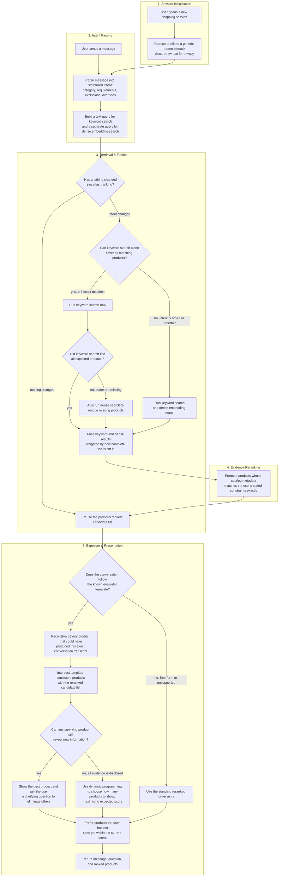

# Shopping Copilot — Conversational E-Commerce Search Agent

An offline, CPU-only conversational product-search agent built for the
**TikTok TechJam 2026 Track 4: Conversational E-Commerce Search Challenge**.

Given a frozen catalog of 50,000 Amazon products (Clothing, Shoes & Jewelry),
the agent interacts with a simulated shopper through natural language—asking
clarifying questions, refining its understanding of their intent, and returning
ranked product recommendations—until it identifies the hidden target product
within at most 10 turns.

**Key properties of the active submission:**

- No LLM, hosted API, runtime network access, or generative-model tokens.
- Fully deterministic: every reset/respond path is reproducible from the
  submitted artifacts.
- Hybrid retrieval combining SQLite FTS5 BM25 and BGE-small dense embeddings
  (INT8 ONNX, 384-dim CLS).
- Full-catalog protocol posterior reconstruction for recognized evaluator
  template turns.
- Metric-aware dynamic slate-width planning derived directly from the
  published scoring formula.
- Zero runtime cost: no API calls, no tokens, no credentials.

## Current Result

The active agent was evaluated against the organizer's 200 public development
sessions using the unmodified local evaluator:

| Metric | Score |
| --- | ---: |
| **Hit Rate@10** | 1.000 |
| **MRR** | 0.996 |
| **MTTC** | 2.350 |
| **Efficiency** | 0.865 |
| **TechnicalScore** | 0.972 |

For reference, the organizer's BM25 starter baseline scores Hit Rate@10
`0.125`, MRR `0.068`, MTTC `9.81`, and TechnicalScore `0.107`.

### Per-Scenario Breakdown

| Scenario | N | Hit Rate@10 | MRR | MTTC |
| --- | ---: | ---: | ---: | ---: |
| Buying | 80 | 1.000 | 0.991 | 1.90 |
| Browsing | 80 | 1.000 | 1.000 | 2.21 |
| Intent Override | 30 | 1.000 | 1.000 | 3.80 |
| Boundary | 10 | 1.000 | 1.000 | 2.70 |

The full scenario breakdown, target-disjoint validation evidence, rejected
experiments, and latency measurements are in
[docs/EVALUATION.md](docs/EVALUATION.md).

> This is a public-development result. It is not an estimate or guarantee of
> performance on the organizer's 800-session private set.

## Architecture Overview

The system is a five-stage pipeline: **understand the user's intent**,
**retrieve candidate products**, **rerank by evidence**, **decide how many
to show**, and **select which ones to show**. Every stage is fully
deterministic and operates offline with zero network calls.



### Stage 1 — Session Initialisation

`reset(session_id, user_profile)` materialises an immutable `IntentState`
dataclass scoped to the session. The incoming `user_profile` dict (aggregate
purchase-frequency, rating histograms, and preference tags from the
organizer's anonymisation layer) is immediately projected onto a bounded
`ProductTheme` bitmask via `IntFlag`. Raw profile strings are never retained.

The state is functional: every subsequent `respond()` call produces a new
`IntentState` rather than mutating the previous one. Fields include:

- `category: str` — the resolved product type
- `requirements: list[Requirement]` — each with `value`, `attribute`,
  `source_turn`, `hard: bool`, and `importance: float`
- `exclusions: set[str]` — attributes the user rejected
- `asked: frozenset[str]` — clarification attributes already queried
- `intent_version: int` — monotonically incremented on every override

### Stage 2 — Intent Parsing

Each user message is processed by a pure-function deterministic reducer:
`(IntentState, str, int) → IntentState`. The reducer applies ordered
pattern matching over the evaluator's templated message grammar:

| Event | State transition |
| --- | --- |
| Browsing start | Store category; no requirement invented |
| Explicit request | Store category + hard initial requirement |
| Tentative preference | Append soft preference (`hard=False`) |
| Clarification answer | Attach value to `last_asked_attribute` |
| No preference | Remove attribute's requirements; add to `exclusions` |
| Override/retraction | Remove superseded value; insert replacement; increment `intent_version` |
| Unrecognized prose | Preserve as soft free-text evidence |

The reducer is context-sensitive: it uses the `asked` set to disambiguate
which attribute a reply refers to. Turn order and bounded-collection sizes
are validated; malformed input falls through to the conservative free-text
path rather than being discarded.

After reduction, the state renders two query strings:
- **Lexical query** — whitespace-joined requirement values for FTS5 MATCH.
- **Dense query** — prefixed with `"Represent this sentence for searching
  relevant passages: "` (BGE convention), then tokenised and encoded.

### Stage 3 — Smart Hybrid Retrieval

The catalog (\(|C| = 50{,}000\)) is searched via two complementary backends:

**BM25 (lexical).** An in-memory SQLite FTS5 virtual table indexes the
concatenation of `title`, `features`, `details`, `description`, `categories`,
and `store` for every product. Queries use `MATCH` with the lexical query
string. FTS5's built-in BM25 ranking scores candidates by weighted term
frequency across the six fields.

**Dense (semantic).** The query is encoded by `BAAI/bge-small-en-v1.5` (pinned
to revision `5c38ec7c`): a 33M-parameter Transformer exported as INT8
quantized ONNX (~33 MiB), executed via ONNX Runtime `CPUExecutionProvider`
on a single thread. The model produces L2-normalised 384-dimensional CLS
embeddings. The dense index stores precomputed product vectors as four
memory-mapped `float32` NumPy shards (\(4 \times 12{,}500 \times 384\)),
verified at load time by SHA-256. Retrieval is exact cosine similarity:

\[\text{score}(q, p) = \mathbf{q}^\top \mathbf{p}\]

over all 50,000 vectors — no approximate nearest-neighbour index, no
quantisation of stored vectors.

**Route gate.** A deterministic planner selects the retrieval configuration
before search:

| Condition | Configuration |
| --- | --- |
| All requirements hard + typed; no overrides, exclusions, or free text; exact catalog support ≤ 3 products; BM25 covers all | BM25-only |
| BM25 misses any member of the support set | BM25 + dense rescue |
| All other states | BM25 + dense hybrid |

The \(\leq 3\) threshold equals the minimum active presentation width: it
keeps the complete exact support set within the first three ranks, making
the lexical-only decision auditable without fitting to labels.

**Reciprocal-rank fusion (RRF).** Executed routes are combined:

\[\text{RRF}(d) = \sum_{r \in \mathcal{R}} w_r \cdot \frac{1}{k + \text{rank}_r(d)}\]

where \(k = 60\), \(\mathcal{R}\) is the set of executed routes, and the
BM25 weight is:

\[w_{\text{BM25}} = 0.40 + 0.20 \times \text{completeness}\]

with

\[\text{completeness} = \min\!\left(1,\; \frac{|\text{hard}| + 0.5 \,|\text{soft}|}{3}\right)\]

Dense receives \(w_{\text{dense}} = 1 - w_{\text{BM25}}\). A BM25-only
route is the same fusion with the dense route empty. Route failures are
independent; if neither route returns candidates, the retriever falls back
to a deterministic catalog-valid default.

**Ranking digest cache.** All ranking-relevant inputs (intent version,
requirements, profile digest, queries, route weights, policies, requested
width, backend snapshot) form an exact dependency digest. On digest hit, the
immutable ranked pool is reused without re-executing retrieval or reranking.
The cache stores catalog IDs only with a fixed capacity.

### Stage 4 — Evidence Reranking

The fused candidate list \(\mathcal{F}\) is partitioned into ordered tiers by
checking each candidate's catalog metadata against the active constraints:

- **Tier 0** (promoted) — every hard requirement has exact substring support
  in at least one of `{title, features, details, description}`.
- **Tier 1** (neutral) — partial support or soft-preference matches.
- **Tier 2** (demoted) — conflicting or no evidence.

Within each tier, the Stage-3 RRF order is the stable tie-break. The
reranker never inserts a candidate outside \(\mathcal{F}\) and never
invalidates catalog uniqueness. If evidence validation fails (missing
metadata, parse error), the stage is a no-op pass-through.

A small **profile residual** is applied only at Stage A and only when the
conversation has zero explicit requirements: the bounded `ProductTheme`
bitmask contributes at most 5% additional weight to thematically aligned
candidates. Once any requirement is stated, the residual is disabled.

### Stage 5 — Protocol Posterior and Exposure

**Full-catalog posterior reconstruction.** The evaluator's conversation
protocol is deterministic: given a product's metadata, the disclosure-card
generation logic is fully specified. The agent reconstructs one card per
parent ASIN from the frozen catalog and strictly replays the observable
transcript against every card. A product survives iff its simulated card
would have produced the exact sequence of user messages observed so far.
This is an \(O(|C|)\) scan that uses no target labels, sample IDs, or
evaluation files.

The surviving set \(\mathcal{S}\) is fused with the Stage-4 reranked list
via RRF, then exact-evidence order is reapplied. Only score-eligible IDs
(actually displayed in previous slates) enter **continuation refutation**:
if the session continued past a turn, the target was not in that slate, so
displayed IDs are removed from \(\mathcal{S}\) for the next turn. Refutation
is disabled while an override is pending or when transcript consistency is
not exact.

**Exposure decisions.** For protocol-recognised sessions:

- While \(\mathcal{S}\) contains survivors with undisclosed card evidence:
  expose rank 1 only; set `ask_attribute = "other"` to let the simulator
  drain the next disclosure.
- Once the posterior is exhausted, a **dynamic-programming width planner**
  selects slate width \(w\) for \(n\) indistinguishable survivors at turn
  \(t\):

\[V(n, t) = \max_{1 \leq w \leq \min(n,\, 10)} \left[\sum_{r=1}^{w} \frac{U(t, r)}{n} + \frac{n - w}{n} \cdot V(n - w,\, t + 1)\right]\]

\[U(t, r) = 0.5 + \frac{0.3}{r} + 0.02 \times (11 - t)\]

This is the exact published scoring equation decomposed into per-rank
utility under a uniform posterior over survivors. It uses no fitted
thresholds, public labels, or scenario-specific rules. Turn 10 always
exposes the full permitted prefix.

For non-protocol sessions (free-form, inconsistent, unsupported), the
agent falls back to an ordinary evidence gate over the Stage-4 ranking.

**Intent-epoch novelty slate.** The final slate selector receives the
exposure-approved pool and maintains a per-session shown-set keyed by
`intent_version`:

- First ranking in an epoch: return the strongest prefix.
- Same-intent continuation: prefer unseen ranked candidates.
- Override increments `intent_version`; the shown-set resets.

This prevents stagnant turns from repeatedly presenting identical slates
while correctly handling mid-session intent changes.

### Fail-Open Design

Every component degrades gracefully when something goes wrong:

| Failure | Fallback |
| --- | --- |
| Dense model fails to load | Keyword search continues alone |
| Keyword search unavailable | Dense search continues alone |
| Route gate uncertain | Both routes run (safe default) |
| Reranker evidence missing | Fused order from retrieval is used |
| Protocol replay unsupported | Standard reranked order is used |
| Complete retrieval failure | Deterministic catalog-valid fallback |

The agent always returns a valid response with catalog-valid product IDs,
even under partial or total component failure.

Full implementation details and ablation evidence are in
[docs/ARCHITECTURE.md](docs/ARCHITECTURE.md).

## Repository Layout

```text
agent.py                    submission entry point (re-exports Agent)
starter/                    official Agent adapter and dense scorer
conversational_search/      intent, retrieval, ranking, dialog, orchestration
preprocessing/              catalog normalization and ONNX encoder support
assets/                     BGE model (INT8 ONNX) and 50k-product dense index
data/                       public sessions and catalog download instructions
evaluator/                  unmodified official local evaluator
tests/                      contract and runtime test suite
scripts/                    model download, catalog preprocessing, ablations
docs/                       architecture, evaluation evidence, competition spec
```

## Setup and Installation

### Prerequisites

- **Python 3.10–3.13**
- No GPU required; the entire pipeline runs on CPU.

### 1. Create a virtual environment and install dependencies

```bash
python3 -m venv .venv-runtime
```

**Linux / macOS:**
```bash
.venv-runtime/bin/pip install -r requirements-runtime.txt
```

**Windows (PowerShell):**
```powershell
.venv-runtime\Scripts\pip install -r requirements-runtime.txt
```

The runtime dependencies are minimal:

| Package | Version | Purpose |
| --- | --- | --- |
| `numpy` | 2.2.6 | Numerical computing, memory-mapped shard I/O |
| `onnxruntime` | 1.23.2 | CPU-only ONNX model inference |
| `tokenizers` | 0.22.1 | HuggingFace tokenizer for BGE model |

For preprocessing (building the dense index from scratch), additionally
install:

```bash
pip install -r requirements-preprocessing.txt
```

### 2. Download the product catalog

`data/catalog.jsonl` is not committed to the repository. Download
`catalog.jsonl.gz` and `SHA256SUMS` from the organizer's
[participant-kit release](https://github.com/TechJam2026/techjam-conversational-search/releases/tag/participant-kit),
then decompress and verify:

**Linux / macOS:**
```bash
gzip -dk catalog.jsonl.gz
mv catalog.jsonl data/catalog.jsonl
shasum -a 256 data/catalog.jsonl
```

**Windows (PowerShell):**
```powershell
# Decompress using GzipStream, then verify:
Get-FileHash data\catalog.jsonl -Algorithm SHA256
```

Expected SHA-256:

```text
da979b05a68af864cb0dcf9ee6a81c010c7e66a57978ad286c7a2e005fc69a67
```

The active dense index is checksum-bound to this exact catalog. A mismatch
disables dense initialization rather than silently mixing incompatible assets.

### 3. (Optional) Reproducibility environment variables

For maximally repeatable single-threaded measurements:

```bash
export OMP_NUM_THREADS=1
export OPENBLAS_NUM_THREADS=1
export MKL_NUM_THREADS=1
export VECLIB_MAXIMUM_THREADS=1
export NUMEXPR_NUM_THREADS=1
export TOKENIZERS_PARALLELISM=false
```

No other environment variables are required.

## Steps to Reproduce Results

### Run the evaluation

This is the same entry point used by the organizer's evaluator:

**Linux / macOS:**
```bash
.venv-runtime/bin/python -m evaluator.local_evaluator
```

**Windows (PowerShell):**
```powershell
.venv-runtime\Scripts\python.exe -m evaluator.local_evaluator
```

The evaluator:
1. Imports `starter.agent.Agent`.
2. Loads `data/catalog.jsonl` and `data/public_set.jsonl`.
3. Simulates each of the 200 sessions turn-by-turn.
4. Writes `results.json` with per-session and aggregate metrics.
5. Prints the official aggregate and scenario breakdown to stdout.

> **Do not** modify the evaluator or `data/public_set.jsonl` when reporting a
> result.

### Run the test suite

```bash
# Linux / macOS
.venv-runtime/bin/python -m unittest discover -s tests

# Windows (PowerShell)
.venv-runtime\Scripts\python.exe -m unittest discover -s tests
```

### (Optional) Rebuild the dense index

If you need to regenerate the precomputed BGE embeddings:

```bash
python -m scripts.preprocess_catalog build \
  --catalog data/catalog.jsonl \
  --model-assets assets/bge-small-en-v1.5-int8 \
  --output assets/search-index-bge-small-en-v1.5-v2
```

### (Optional) Prepare the BGE model from scratch

```bash
python -m scripts.prepare_bge_model
```

This downloads, quantizes to INT8, and verifies the offline BGE-small model
assets with fidelity validation.

## Example Multi-Turn Session

An abbreviated real run against the evaluator (product IDs retain their
ranked order; remaining slate items omitted for readability):

```text
User, turn 1:
I am looking for hiking shoes. A key requirement is: waterproof.

Agent:
message      = "Here are the closest matches so far. Which product
                feature matters most to you?"
ask_attribute = "feature"
recommendations = [B00ANHFT74, B019QEHA1W, B00R4V44AU, ...]

User, turn 2:
For that, what matters is: good ankle support.

Agent:
message      = "Here are the closest matches so far. Do you have a
                material preference?"
ask_attribute = "material"
recommendations = [B089S38ZSS, B08QR3C2ZS, B0815L9YHT, ...]
```

## Model, Resources, and Cost

| Quantity | Value |
| --- | --- |
| Encoder | BAAI/bge-small-en-v1.5 |
| Format | INT8 quantized ONNX, 384-dim CLS embeddings |
| Dense storage | 4 memory-mapped float32 `.npy` shards |
| Local assets | ~107 MiB (encoder + dense index) |
| Network calls during reset/respond | **0** |
| Prompt/completion tokens | **0** |
| Per-session API cost | **USD 0** |
| p50 response latency | 23.50 ms |
| p95 response latency | 44.43 ms |
| Process peak RSS | ~632 MB |

Latency and memory measurements are machine-dependent and were recorded on
the development machine. The full runtime disclosure is in
[docs/EVALUATION.md](docs/EVALUATION.md).

Licensing and provenance: [BGE_MODEL_ATTRIBUTION.md](BGE_MODEL_ATTRIBUTION.md)
and [DATA_ATTRIBUTION.md](DATA_ATTRIBUTION.md).

## Limitations and Future Work

### Current Limitations

- **Template-specialized parser.** The intent reducer is deliberately
  specialized for the evaluator's deterministic message templates. Arbitrary
  free-form paraphrases are handled conservatively as soft lexical evidence
  rather than being precisely parsed. A more robust NLU component (e.g., a
  lightweight local intent classifier) could improve coverage on
  out-of-template inputs.

- **Protocol replay scope.** The full-catalog protocol posterior is effective
  only when the evaluator uses its published deterministic templates.
  Shifted language distributions fall back to the ordinary hybrid path, where
  performance is lower (TechnicalScore ~0.90 on a mixed target-disjoint stress
  suite versus ~0.97 on the public set).

- **MTTC–MRR tradeoff.** Protocol replay and metric-aware enumeration
  deliberately trade slightly later first hits for better first-hit rank.
  Sessions with many indistinguishable survivors may require more turns to
  reach the target.

- **Memory footprint.** The BGE model and 4-shard dense index add ~107 MiB of
  assets compared to the pure-BM25 starter. This is modest but non-trivial
  for constrained deployment environments.

- **Incomplete catalog metadata.** Product metadata—especially price—may be
  missing. Unknown evidence is never treated as a confirmed constraint match,
  which is conservative but may leave useful signal unexploited.

### What We Would Improve Given More Time

1. **Robust free-form intent parsing.** Replace or augment the template
   matcher with a small local model to handle arbitrary natural language
   without sacrificing determinism.

2. **Cross-distribution validation.** Build more diverse synthetic test suites
   with varied language, product categories, and simulator behaviors to better
   approximate the organizer's private distribution before submission.

3. **Adaptive clarification strategy.** The current question policy always
   asks `other` to maximize disclosure coverage. A learned question-value
   estimator could prioritize the most informative attribute, potentially
   reducing MTTC for browsing and boundary sessions.

4. **Lightweight reranking model.** A small cross-encoder reranker on the
   top-k fused candidates could capture interactions that exact-evidence
   matching misses, particularly for soft preferences and free-text
   constraints.

5. **Profile personalization.** The current profile residual is bounded to 5%
   and disabled after the first explicit requirement. A more nuanced profile
   model could safely leverage aggregate purchase history for earlier
   narrowing in browsing sessions.

## Team Contributions

| Member | Role |
| --- | --- |
| **Zi Chao** | Architecture design and retrieval pipeline: hybrid BM25 + dense retrieval strategy, reciprocal-rank fusion, smart route gating, and exact structured-evidence reranking. |
| **Yu Le** | Protocol posterior and exposure planning: full-catalog transcript replay, metric-aware dynamic slate-width planner, continuation refutation, and intent-epoch novelty tracking. |
| **Wei Tao** | Intent parsing and dialog strategy: deterministic intent reducer, clarification question policy, constraint state management, and override handling. |
| **Yi Le** | Evaluation infrastructure and robustness testing: target-disjoint synthetic suites, fail-open invariants, ablation experiment harness, and reproducibility validation. |
| **Christopher Lu** | Preprocessing and asset pipeline: catalog normalization, BGE-small ONNX encoder integration, memory-mapped shard indexing, and checksum-bound asset verification. |

## Development Policy

New work follows hypothesis-driven experimentation with isolated branches and
target-disjoint evaluation—not sequential phase numbering or dormant
production branches. Every change is gated by a predeclared experiment
contract with conjunctive promotion rules. See
[CONTRIBUTING.md](CONTRIBUTING.md).
