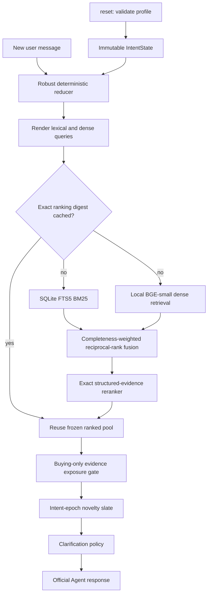

# Shopping Copilot

An offline, CPU-only conversational product-search agent for TikTok TechJam
2026 Track 4. It maintains an immutable session intent state, retrieves from
both BM25 and BGE-small, reranks with structured catalog evidence, asks bounded
clarifying questions, and returns catalog-valid `parent_asin` values through
the official `Agent` interface.

The active submission uses no hosted API, no runtime network access, and no
generative-model tokens.

## Current result

The active agent reproduces the following score on the organizer's 200 public
sessions:

| Metric | Result |
| --- | ---: |
| Hit Rate@10 | 0.985 |
| MRR | 0.744397 |
| MTTC | 2.445 |
| TechnicalScore | 0.886919 |

This is a public-development result, not an estimate or guarantee of the
private 800-session score. See [docs/EVALUATION.md](docs/EVALUATION.md) for the
scenario breakdown, target-disjoint validation, rejected experiments, latency,
and limitations.

## Active architecture



Important active-policy facts:

- BM25 and dense retrieval both run on a fresh search. If either route fails,
  the other route and deterministic fallback remain available.
- The BM25 weight moves only from 0.40 to 0.60 as explicit intent becomes more
  complete; dense receives the complementary weight.
- Exact catalog evidence reranks the fused union. It fails open to the fused
  ranking if evidence cannot be validated.
- A small profile residual is allowed only before the conversation has explicit
  requirements.
- Same-intent continuation turns prefer unseen products. An override increments
  the intent epoch and resets that novelty boundary.
- The exposure gate is not globally fixed to three. In a structurally safe
  buying state it may expose one to three products or a three-product prefix
  while asking a question. Uncertain, browsing, final-turn, or faulted states
  return the safe full-width result.
- Semantic-to-lexical query repair and score-threshold dynamic exposure were
  evaluated but are not active because they did not improve the frozen tests.

The implementation details and fail-open invariants are documented in
[docs/ARCHITECTURE.md](docs/ARCHITECTURE.md).

## Repository layout

```text
agent.py                    convenience Agent export
starter/                    official entry point and dense scorer
conversational_search/      intent, retrieval, ranking, dialog, and orchestration
preprocessing/              catalog text and pinned ONNX encoder support
assets/                     active BGE model and 50k-product dense index
data/                       public sessions and catalog download instructions
evaluator/                  unmodified official local evaluator
tests/                      focused contract and runtime tests
docs/                       official contracts plus final architecture/evaluation
scripts/                    only reproducible model/index preparation commands
```

Historical phase logs, raw benchmark directories, rejected-model assets, and
one-off ablation runners are intentionally absent from the current tree. Their
tracked history remains recoverable in Git.

## Setup

Python 3.10 through 3.13 is supported. The measured submission uses one CPU
thread for ONNX inference.

```bash
python3 -m venv .venv-runtime
.venv-runtime/bin/pip install -r requirements-runtime.txt
```

No environment variable is required. For maximally repeatable single-threaded
measurements, set:

```bash
export OMP_NUM_THREADS=1
export OPENBLAS_NUM_THREADS=1
export MKL_NUM_THREADS=1
export VECLIB_MAXIMUM_THREADS=1
export NUMEXPR_NUM_THREADS=1
export TOKENIZERS_PARALLELISM=false
```

### Catalog

`data/catalog.jsonl` is intentionally not committed. Download
`catalog.jsonl.gz` and `SHA256SUMS` from the organizer's
[participant-kit release](https://github.com/TechJam2026/techjam-conversational-search/releases/tag/participant-kit),
then place the decompressed file at `data/catalog.jsonl`:

```bash
gzip -dk catalog.jsonl.gz
mv catalog.jsonl data/catalog.jsonl
shasum -a 256 data/catalog.jsonl
```

Expected SHA-256:

```text
da979b05a68af864cb0dcf9ee6a81c010c7e66a57978ad286c7a2e005fc69a67
```

The active dense index is checksum-bound to that exact catalog. A mismatch
disables dense initialization rather than silently mixing incompatible assets.

## Run and reproduce

Run the same entry point used by the published evaluator:

```bash
.venv-runtime/bin/python -m evaluator.local_evaluator
```

The evaluator imports `starter.agent.Agent`, writes `results.json`, and
reports the official aggregate and scenario metrics. Do not modify the
evaluator or `data/public_set.jsonl` when reporting a result.

Run the focused test suite:

```bash
.venv-runtime/bin/python -m unittest discover -s tests
```

The root [agent.py](agent.py) also exports the identical `Agent` class for
submission systems that expect a single obvious entry module.

## Example multi-turn session

The following is an abbreviated real run; product IDs retain their ranked
order, with the remainder of each ten-item slate omitted here for readability.

```text
User, turn 1:
I am looking for hiking shoes. A key requirement is: waterproof.

Agent:
message = "Here are the closest matches so far. Which product feature matters most to you?"
ask_attribute = "feature"
recommendations = [B00ANHFT74, B019QEHA1W, B00R4V44AU, ...]

User, turn 2:
For that, what matters is: good ankle support.

Agent:
message = "Here are the closest matches so far. Do you have a material preference?"
ask_attribute = "material"
recommendations = [B089S38ZSS, B08QR3C2ZS, B0815L9YHT, ...]
```

## Model, resources, and cost

- Encoder: `BAAI/bge-small-en-v1.5`, pinned to revision
  `5c38ec7c405ec4b44b94cc5a9bb96e735b38267a`.
- Runtime: verified INT8 ONNX, normalized 384-dimensional CLS embeddings,
  NumPy, ONNX Runtime CPU, and `tokenizers`.
- Dense storage: four memory-mapped float32 shards; no vector database.
- Active local assets: about 107 MiB for the model and dense index.
- Network calls during reset/respond: zero.
- Prompt/completion tokens: zero.
- Per-session model/API cost: USD 0.
- Public-run measured response latency: p50 23.50 ms, p95 44.43 ms on the
  development machine; environment-dependent.
- Measured process peak RSS in that run: about 632 MB, including evaluator,
  catalog index, model runtime, and caches.

Licensing and provenance are in [BGE_MODEL_ATTRIBUTION.md](BGE_MODEL_ATTRIBUTION.md)
and [DATA_ATTRIBUTION.md](DATA_ATTRIBUTION.md).

## Limitations

- The rules-based language reducer intentionally fails open on unfamiliar or
  ambiguous prose; it is not a general natural-language understanding model.
- Public sessions influenced development, so the public score cannot establish
  private-set generalization.
- Target-disjoint synthetic suites reduce direct target memorization risk but
  cannot reproduce the organizer's hidden purchase distribution.
- The exposure gate improves public MRR but was weaker on one harder
  language-shift suite. Unsafe states therefore return the full baseline slate.
- The local model/index increase memory and repository asset size compared with
  the weak BM25 starter.
- Catalog metadata may be incomplete, especially price. Unknown evidence is
  never treated as a confirmed constraint match.

## Team contributions

- Participant implementation and evaluation: GitHub contributor
  `mysterious-joker`.
- Competition kit, evaluator, API contract, and frozen public data:
  `TechJam2026`.

For a multi-person Devpost team, replace the participant line with the exact
member-by-member contribution split before submission.

## Development policy

New work should use hypothesis names, isolated branches, and target-disjoint
evaluation—not `phase20`, `phase21`, or new dormant production branches.
See [CONTRIBUTING.md](CONTRIBUTING.md).
