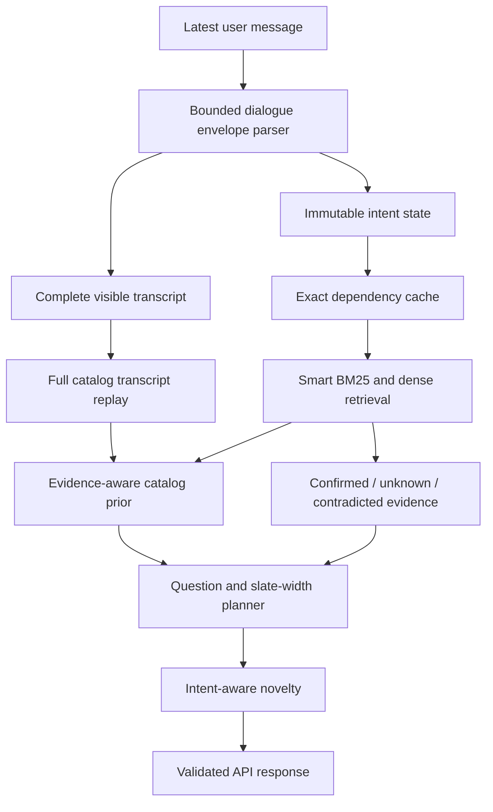

# Architecture

The submission configuration is selected in `starter/agent.py`. The root
`agent.py` re-exports it. All inference runs locally on CPU.

## Language and state

`language.py` normalizes only explicit, bounded speech acts. It retains product
payloads, punctuation, and order; contextual replies require an outstanding
question. Attribute declines and exhaustion of additional preferences remain
distinct. Both intent reduction and transcript parsing consume the same
interpretation, preventing disagreement between retrieval and planning.

`intent.py` maintains category, requirements with provenance and importance,
no-preference attributes, asked attributes, and the intent version. Explicit
replacement retires superseded evidence and advances the version. Unsupported
prose remains available to ordinary retrieval.

## Retrieval and evidence

`retrieval.py` combines SQLite FTS5 BM25 with BGE-small INT8 ONNX query
embeddings and four memory-mapped float32 catalog shards. The index, tokenizer,
model, and catalog are checksum-bound. Smart routing skips dense inference
only when the catalog establishes complete, narrow typed support and the
lexical route covers it. Missing or inconsistent support restores hybrid
retrieval.

`exact_evidence.py` ranks confirmed evidence above unknown evidence and
contradictions. With product evidence present, catalog review counts resolve
equal evidence tiers before the original hybrid order. On the first
category-only browsing turn, `service.py` uses the same catalog prior directly;
there is no product evidence for semantic retrieval to rank yet. After the
first reply, transcript evidence and hybrid retrieval regain control. Profile
themes are bounded secondary evidence; they cannot overrule explicit
constraints. Cache reuse requires equality of every ranking-relevant
dependency, including intent and backend identity.

## Dialogue planning

`protocol_index.py` reconstructs support by replaying the complete visible
transcript against catalog-derived cards. A recognizable envelope is only an
input to this check. Unsupported turns cannot leave a partial transcript that
later resumes exact inference. Exhausted or inconsistent support returns to
ordinary retrieval.

Eligible continuation refutation removes only previously displayed products
when the transcript permits that inference. Tentative intent before a
scheduled override does not trigger premature refutation.

`disclosure_planner.py` compares valid questions by rolling each possible reply
forward through wildcard disclosures and ranked enumeration to the turn limit.
The planner also compares its best question with direct ranked enumeration. It
may stop asking only when enumeration has at least as much modeled utility and
keeps the current response at rank-one width. Once selected, enumeration
continues while the shopper supplies no new evidence; a disclosure or override
allows information gathering to be reconsidered. This commitment prevents a
late return to an earlier question from shifting the deadline slate.

The planner retains the current rank-one preview, includes the complete catalog
support, and groups replies by their exact visible strings. Candidate weights
follow the reciprocal-rank prior used by exact-evidence beliefs. Ties retain
`other`; pending overrides retain the wildcard policy. For a first-turn request
that already supplies a hard requirement, a specific question must beat
`other` by more than one rank-two, one-turn utility quantum; otherwise the
wildcard's two-value disclosure is preferred. The agent replans after each
actual reply, so the rollout's fixed future ordering remains an approximation.

`exposure.py` uses this question choice and selects recommendation widths by
balancing immediate rank utility against later opportunities under the same
rank prior. During enumeration, it reserves enough remaining slots to cover
all reachable survivors by the deadline. `slates.py` preserves
novelty within an intent epoch. `service.py` validates the response and reports
the executed planner outcome, normalization flag, question, and presented
width through an optional diagnostic hook.

## Runtime and submission

The agent has no network client, hosted model, credentials, runtime evaluation
labels, or cross-user target memory. Reset creates session-local state.
Failures retain deterministic lexical fallback. The release check verifies
all bundled assets, requires every intended backend to initialize, exercises
actual dense inference, and checks repeated reset/respond behavior under an
offline audit guard.
